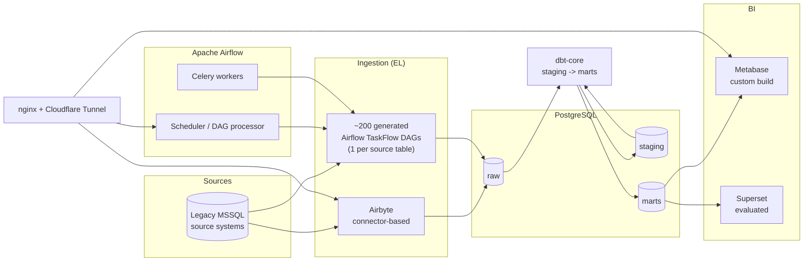

# Self-Hosted Analytics Platform — Reference Architecture

> A write-up of a production analytics platform I designed and operate for a mid-size financial services company: ingestion, orchestration, transformation, storage and BI, running self-hosted on a single Linux host.
>
> **This repository contains no proprietary business data, credentials, internal hostnames, or company-specific schema.** Every example is generic and rebuilt from scratch to illustrate the *patterns* used in production, not the production code itself. See [Anonymization note](#anonymization-note).

## Why this exists

Most public "data stack" write-ups describe greenfield setups on managed cloud services (Snowflake, Fivetran, managed Airflow). This one is different: a **from-scratch, self-hosted stack on a single VM**, built and operated under real constraints — legacy on-prem source systems (MSSQL/SSRS), a fixed infrastructure budget, and a small (one-person) data engineering team. It documents the trade-offs, the tooling choices, and one specific case where I patched open-source BI software to fix a limitation that was blocking the business.

## Stack at a glance

| Layer | Technology | Notes |
|---|---|---|
| Orchestration | **Apache Airflow 3.x** (CeleryExecutor) | Docker Compose: apiserver, scheduler, dag-processor, worker, triggerer, dedicated Postgres + Redis |
| Ingestion (EL) | **Airflow TaskFlow DAGs** (custom, per-source-table) + **Airbyte** | Hybrid: connector-based ingestion where it fits, hand-written extract/load for legacy sources that need fine-grained control |
| Transformation (T) | **dbt-core** (postgres adapter) | Layered `staging` → `marts` models, scheduled via cron |
| Storage | **PostgreSQL** | Central analytics warehouse, schema-per-stage, role-based access (incl. LDAP/AD-backed roles for analysts) |
| BI | **Metabase**, built from source with a custom patch (case study below); Superset evaluated in parallel | Multi-version image strategy for safe rollback |
| Edge / networking | **nginx** (TLS termination, subdomain routing) + **Cloudflare Tunnel** | Single reverse proxy in front of every internal service |
| Infra | Single Azure VM, Ubuntu 22.04, Docker Compose per service | No Kubernetes — deliberately kept operationally simple for a small team |

## Architecture



## What I designed and own

- **Ingestion strategy**: a hybrid EL layer — Airbyte for sources with good off-the-shelf connectors, and ~200 generated Airflow TaskFlow DAGs (one per source table) for a legacy MSSQL reporting database that needed table-by-table control over schedule and incrementality. See [`examples/airflow/`](examples/airflow/).
- **Transformation layer**: a dbt project with a `staging → marts` layering convention, materialization strategy per layer, and a custom `generate_schema_name` macro. See [`examples/dbt/`](examples/dbt/).
- **BI platform**: built and operate a custom Metabase image compiled from source (Clojure/JVM backend, React/Bun frontend), including a source-level patch to the pivot-table query engine — see the [case study](docs/case-study-metabase-pivot-patch.md).
- **Edge/networking**: single nginx reverse proxy terminating TLS for every internal service, fronted by a Cloudflare Tunnel instead of opening inbound ports directly on the host.
- **Access model**: warehouse roles scoped per tool (ingestion, transformation, BI each get their own least-privilege Postgres role), with analyst access backed by the company's existing Active Directory/LDAP rather than shared local accounts.

## Case study: patching Metabase's pivot-table row limit

Read the full write-up: [`docs/case-study-metabase-pivot-patch.md`](docs/case-study-metabase-pivot-patch.md)

Short version: Metabase's pivot query processor divides its row cap by the number of aggregation columns in the query, which meant multi-metric pivot exports were being truncated well below what the business needed. I traced it to `query_processor/pivot.clj`, patched the limit calculation, rebuilt Metabase from source, and rolled it out with a versioned image strategy that kept every prior build available for instant rollback.

## Repository layout

```
docs/                          architecture notes and the Metabase case study
examples/airflow/              generic example of the per-table EL DAG pattern
examples/dbt/                  generic example dbt project layout (staging -> marts)
examples/docker-compose/       sanitized compose skeletons (Airflow, dbt runner)
examples/nginx/                sanitized reverse-proxy config pattern
```

## Anonymization note

Everything under `examples/` and `docs/` in this repo is **rewritten from scratch** using generic table/column/domain names (`orders`, `customers`, `source_system`, etc.). No real hostnames, credentials, certificates, connection strings, internal database/schema names, or business-specific table structures from any employer are included here. The Metabase patch shown in the case study applies to the public, open-source Metabase codebase (AGPL-3.0) and contains no proprietary code.

## License

Code samples in this repository are released under the [MIT License](LICENSE). The Metabase excerpt referenced in the case study remains under Metabase's own license (AGPL-3.0); see the case study for attribution.
